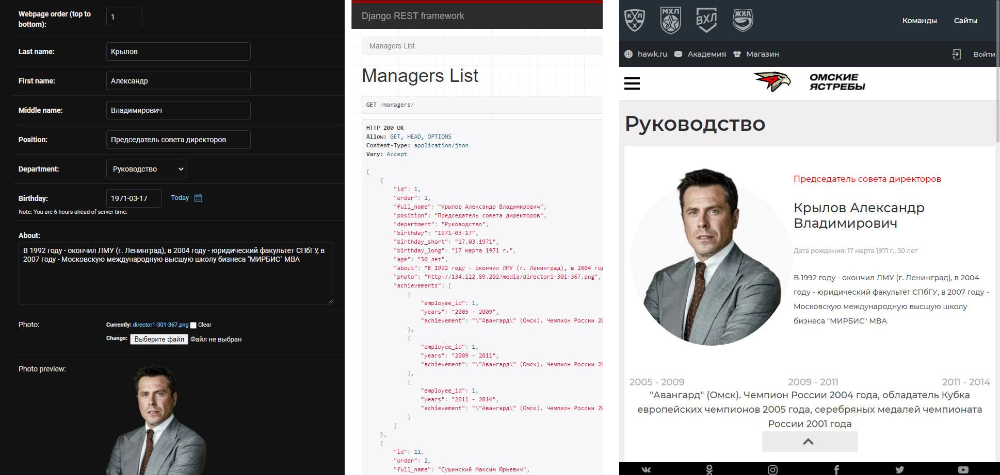

## About

This is the source code of the Omsk-Wings [Backend](http://134.122.89.202/qfpGD7tugecQ0SySlbyn/). The Backend is based on Django framework
and provides REST API endpoints for the [Frontend](https://omsk-wings.effective.band/fanclub) application. APIs supply
Frontend with all the necessary content. You can check out the syncronisation between Frontend and Backend by modifying
data in the [Admin panel](http://134.122.89.202/guRptSijfkB20OWr6T0k/).

To log in use the following credentials:
<br>```effective@effective.band```
<br>*(request password from project owner)*



## Installation

The Backend is running on ```python 3.9```

To launch the code locally perform the following tasks:

- create and activate a new virtual environment
- ```git clone https://gitlab.com/studentlabs-ru/2021/omsk-wings/backend.git```
- ```cd backend```
- ```pip install -r requirements.txt```
- ```echo "test_key" > secret_key.txt```
- ```python manage.py runserver```
- in browser ```http://127.0.0.1:8000/qfpGD7tugecQ0SySlbyn/```

## Backend Structure

Once you've launched the application you will see the main page. It contains basic information on Backend structure:

- Database scheme
- The list of API endpoints with corresponding SQL queries and references to Frontend pages
- Additional info on some code features
- 'Admin' button on the top of the page which leads to Admin Panel

## Deployment

Backend is deployed on ```Ubuntu 20.04.2 LTS``` (Digital Ocean).
<br>Django app is served by ```gunicorn``` with ```nginx``` proxy.
<br>[Configuration guide.](https://www.digitalocean.com/community/tutorials/how-to-set-up-django-with-postgres-nginx-and-gunicorn-on-ubuntu-18-04-ru)

Access server:
<br>```ssh root@134.122.89.202```
<br>*(request password from project owner)*

Server configuration:

- gunicorn socket ```sudo nano /etc/systemd/system/gunicorn.socket```
- gunicorn service ```sudo nano /etc/systemd/system/gunicorn.service```
- nginx sites-available ```sudo nano /etc/nginx/sites-available/myproject```
- virtual environment ```cd /home/venv```
- app directory ```cd /home/backend```
- SECRET_KEY ```cat /home/venv/secret_key.txt```

Deployment (performed manually):

- ```cd /home```
- ```rm -r backend```
- ```git clone https://gitlab.com/studentlabs-ru/2021/omsk-wings/backend.git```
- ```sudo systemctl restart gunicorn```
